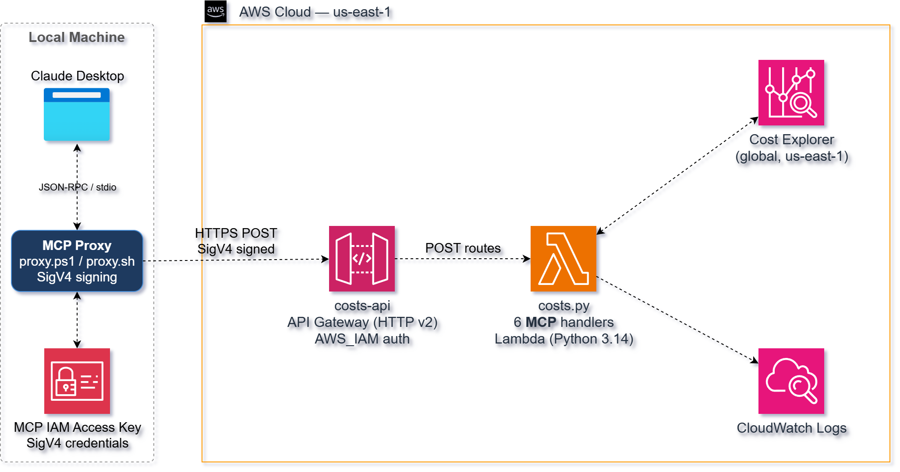
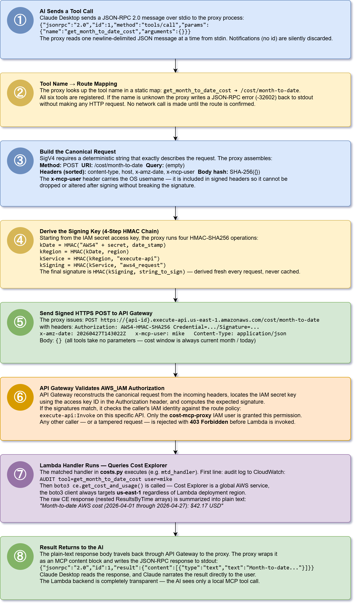

# AWS Serverless MCP — Cost Explorer API

This project delivers a **serverless MCP (Model Context Protocol) backend** on
AWS that lets an AI assistant query AWS costs in plain English. Six Lambda
functions expose cost query tools behind an **Amazon API Gateway HTTP API**
secured with **AWS IAM authorization**. A lightweight local proxy signs each
request with SigV4, making the remote serverless API completely transparent to
the AI caller.

It uses **Terraform** and **Python (boto3)** to provision and deploy the backend,
and a **PowerShell or Bash proxy script** to bridge the MCP stdio transport to
the signed HTTP API.



This design follows a **serverless MCP architecture** where the AI thinks it is
talking to a local tool server, while all tool logic runs in Lambda against the
AWS Cost Explorer API. API Gateway enforces IAM authorization on every route, and
the proxy handles credential management and SigV4 request signing.

Key capabilities demonstrated:

1. **Serverless MCP Tools** – Six Lambda-backed cost query tools exposed as a
   standard MCP tool server, invokable by any MCP-compatible AI client.
2. **IAM-Secured API** – All API Gateway routes require AWS Signature Version 4.
   Unsigned requests are rejected before reaching Lambda.
3. **Thin Local Proxy** – A PowerShell or Bash script reads MCP JSON-RPC from
   stdin, signs requests, and writes results to stdout — no Python runtime required.
4. **Least-Privilege IAM** – Each Lambda function carries only the Cost Explorer
   permission it needs. A dedicated proxy IAM user holds only `execute-api:Invoke`.
5. **Infrastructure as Code** – Terraform provisions all Lambda functions, API
   Gateway routes, IAM roles, and Secrets Manager credentials in a single apply.

Together, these components form a **reference architecture for serverless MCP
tool backends on AWS** — demonstrating how AI tools can be centrally deployed,
versioned, and secured without requiring local runtimes on the caller's machine.

## Prerequisites

* [An AWS Account](https://aws.amazon.com/console/) with Cost Explorer enabled
  (Billing console → Cost Explorer → Enable)
* [Install AWS CLI](https://docs.aws.amazon.com/cli/latest/userguide/getting-started-install.html)
* [Install Terraform](https://developer.hashicorp.com/terraform/install)
* `jq` in PATH (used by `apply.sh` and `validate.sh`)

If this is your first time following along, we recommend starting with this video:  
**[AWS + Terraform: Easy Setup](https://www.youtube.com/watch?v=9clW3VQLyxA)** – it walks through configuring your AWS credentials, Terraform backend, and CLI environment.

## Download this Repository

```bash
git clone https://github.com/mamonaco1973/aws-serverless-mcp.git
cd aws-serverless-mcp
```

## Build the Code

Run [check_env](check_env.sh) to validate your environment, then run [apply](apply.sh) to provision the infrastructure.

```bash
~/aws-serverless-mcp$ ./apply.sh
NOTE: Running environment validation...
NOTE: Validating that required commands are found in your PATH.
NOTE: aws is found in the current PATH.
NOTE: terraform is found in the current PATH.
NOTE: jq is found in the current PATH.
NOTE: All required commands are available.
NOTE: Checking AWS cli connection.
NOTE: Successfully logged into AWS.

Initializing the backend...
```

### Build Results

When the deployment completes, the following resources are created:

- **Core Infrastructure:**
  - Fully serverless architecture — no EC2 instances, containers, or VPC networking
  - Terraform-managed provisioning of API Gateway, Lambda, IAM roles, and Secrets Manager
  - Single-phase deploy from the `01-lambdas` directory

- **Security & IAM:**
  - Six Lambda execution roles, each scoped to the exact Cost Explorer action it needs
  - `cost-mcp-proxy` IAM user with `execute-api:Invoke` only — cannot call CE directly
  - Proxy IAM credentials stored in Secrets Manager secret `cost-mcp-proxy`
  - All API Gateway routes enforce `AWS_IAM` authorization — no unsigned access possible

- **AWS Lambda Functions:**
  - Six Python 3.14 Lambda functions, one per MCP tool, all sharing `costs.py`
  - Each function calls the AWS Cost Explorer API and returns a plain-text summary
  - Independently deployable with scoped IAM roles per function

- **Amazon API Gateway:**
  - HTTP API (`costs-api`) with six POST routes, all requiring SigV4 signing
  - `$default` stage with auto-deploy enabled
  - No CORS — API is designed for server-side proxy callers only

- **MCP Proxy Scripts:**
  - `02-proxy/proxy.ps1` — Windows PowerShell proxy using .NET HMACSHA256 for signing
  - `02-proxy/proxy.sh` — Bash proxy using `openssl` for signing (Linux / Git Bash / macOS)
  - Both implement full MCP JSON-RPC 2.0 stdio transport with SigV4 request signing

- **Claude Desktop Integration:**
  - `apply.sh` generates `02-proxy/claude_desktop_config_ps1.json` and
    `02-proxy/claude_desktop_config_sh.json` with real credentials substituted from
    Secrets Manager — copy the appropriate file to
    `%APPDATA%\Claude\claude_desktop_config.json` and restart Claude Desktop

- **Automation & Validation:**
  - `apply.sh`, `destroy.sh`, and `check_env.sh` automate provisioning, teardown,
    and environment validation
  - `validate.sh` invokes each Lambda directly via `aws lambda invoke` and prints
    the plain-text output — no SigV4 signing required for direct Lambda calls
  - Entire workflow runs using Terraform and AWS CLI — no manual console setup required

Together, these resources form a **clean serverless MCP backend** that demonstrates
how AI tool servers can be centrally deployed and IAM-secured on AWS — scalable,
auditable, and accessible to any MCP-compatible client via a thin local proxy.

---

## MCP Tools

The **Cost Explorer MCP API** exposes six tools through **Amazon API Gateway
(HTTP API)**. All tools take no input parameters and return plain-text summaries
suitable for direct AI narration.

> Note: All routes require **AWS IAM authorization**. The local proxy signs every
> request with SigV4 using the credentials of the `cost-mcp-proxy` IAM user.

### Tool Summary

| Tool | Route | Lambda | Description |
|------|-------|--------|-------------|
| `get_month_to_date_cost` | `POST /cost/month-to-date` | `cost-mtd` | Total AWS spend from the 1st of this month through today |
| `get_cost_by_service` | `POST /cost/by-service` | `cost-by-service` | MTD spend broken down by AWS service, sorted descending |
| `compare_this_month_to_last_month` | `POST /cost/compare-months` | `cost-compare` | This month MTD vs last month full total |
| `get_daily_cost_trend` | `POST /cost/daily-trend` | `cost-daily` | Day-by-day spend for the current month with running totals |
| `find_top_cost_drivers` | `POST /cost/top-drivers` | `cost-top-drivers` | Top 10 AWS services by spend with percentage share |
| `forecast_month_end_cost` | `POST /cost/forecast` | `cost-forecast` | Projected remaining spend through end of month (80% CI) |

### Example Tool Responses

**`get_month_to_date_cost`**
```
Month-to-date AWS cost (2026-04-01 through 2026-04-27): $142.38 USD
```

**`get_cost_by_service`**
```
AWS cost by service (2026-04-01 through 2026-04-27):
  Amazon EC2: $87.14
  Amazon RDS: $31.20
  AWS Lambda: $12.50
  Amazon S3: $8.91
  ...
```

**`find_top_cost_drivers`**
```
Top AWS cost drivers (2026-04-01 through 2026-04-27):
   1. Amazon EC2: $87.14 (61.2% of total)
   2. Amazon RDS: $31.20 (21.9% of total)
   3. AWS Lambda: $12.50 (8.8% of total)
   ...

  Total across all services: $142.38
```

**`forecast_month_end_cost`**
```
AWS cost forecast — remaining April 2026 (2026-04-27 through 2026-04-30):
  Estimated remaining spend: $18.42
  80% confidence range:      $14.10 – $23.75
```

---

### Request & Response Characteristics

| Aspect | Behavior |
|--------|----------|
| Authentication | AWS IAM (SigV4 required) |
| HTTP Method | `POST` for all tools |
| Request Body | Empty JSON object `{}` |
| Content Type | `text/plain` |
| Response Format | Plain-text human-readable summary |
| Clients | MCP proxy (via Claude Desktop or Claude Code) |

---

## MCP Proxy Request Flow


